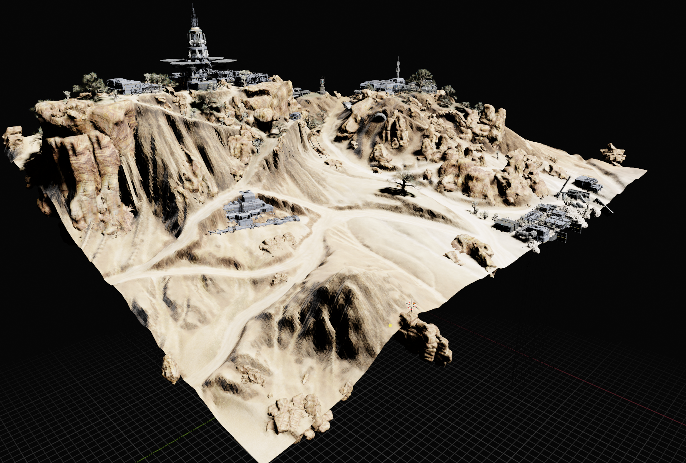

# Forgelight DME model converter

## Table of Contents

1. [Description](#description)
2. [Features](#features)
2. [Caveats](#caveats)
2. [Installation](#installation)
    1. [Compiling `cnk_loader` with Windows](#compiling-cnk_loader-on-windows)
3. [Usage and Examples](#usage-and-examples)
    1. [ADR Converter](#adr-converter)
        * [Examples](#examples)
    2. [DME Converter](#dme-converter)
        * [Examples](#examples-1)
    3. [Zone Converter](#zone-converter)
        * [Examples](#examples-2)

## Description

This repo contains several scripts that allow the conversion of forgelight ADR/DME/Zone models to GLTF2, STL, or OBJ models for use in model viewing and rendering programs. It also contains a python library that allows parsing of DME models which powers the conversion scripts. I made this to convert models to .glb format for import into Blender.

[GLTF2](https://github.com/KhronosGroup/glTF) is the main format supported by these tools. The STL and OBJ scripts *might* still work but are not currently under development or support.

## Features

* Support for loading various filetypes used by the Forgelight engine:
    * `.adr` (Really just XML)
    * `.cnk0`
    * `.cnk1`
    * `.dma`
    * `.dme`
    * `.gfx` (Partial: Only DefineExternalImage2 and ExporterInfo tags parsed)
    * `.mrn` (Partial: Bone names, offsets, rotations, and Skeleton hierarchy only)
    * `.zone`
* Supports exporting models to .glb, .gltf, .stl\*, or .obj\* format
* Exports textures as `.png` files in a `./textures/` directory in the location the model is exported
* Creates a GLTF2 material that approximates the model's in-game look, minus tints (see [Caveats](#caveats))
* Supports skinned models and will export the model pre-rigged with a full skeleton. Vehicles, Weapons, and Human models all typically have skeletons  

* Character models have their bones named such that they can immediately be applied to a Blender [Rigify](https://docs.blender.org/manual/en/3.3/addons/rigging/rigify/index.html) generated IK/FK rig.
* Models can be exported without a skeleton if that is desirable
* Zones (continents) can be exported with a bounding box defining a subset of the continent to export  

* Zones may be exported with or without terrain, static models, and lights using command line flags.

<sup>\* STL and OBJ support is not a high priority and may not be reliable</sup>

## Caveats
This software still has several issues and caveats.  
* Only the basic C/N/S texture maps are used in 95% of exports, with a few atlases added in specific cases for control consoles and computer screens. 
* Detail maps are not used. (on the roadmap to be fixed, possibly)
* If the data strides listed in the DME file do not match the memory layout of the provided material, the tool will list materials that do match, and you may select the one to use depending on the mesh(es) being saved.
* Textures are converted to a PBR metallic roughness material supported by the GLTF standard, which is different than Forgelight's materials.
* Materials in GLTF are not very flexible to implement special tint maps, so vehicles/weapons must have their tints applied after importing the GLTF
    * For this, `./textures/XXXX_T.png` RGB tint maps are exported with Red mapping the Primary faction color, Green mapping the Secondary faction color, and Blue mapping the camo locations.
* Zones can take a while to export due to their size, and then importing the resulting GLTF files will take time as well
* Only LOD0 meshes are exported
* Skeletons are exported with incorrect poses - when imported, the pose will need to be reset to the rest position before the model appears correct.

## Installation

1. After cloning the repository, run `git submodule update --init` to pull in all the needed submodules.
2. Create a virtual environment for the repository with `python3 -m venv venv`
3. Activate the virtual environment:
    * Windows: `& ./venv/bin/Activate.ps1`
    * Linux: `. venv/bin/activate`
4. Run `pip install -r requirements.txt`
5. Navigate to `./dbg-pack/` and run `pip install .`
6. If you need terrain loading, navigate to `./cnk_loader/` and run `pip install .`
    * Windows: check [below](#compiling-cnk_loader-on-windows) for extra instructions

### Compiling `cnk_loader` on Windows

1. Install Visual Studio with the Desktop development with C++ and Python development workloads (VS2019 used when testing)
    * Python native development tools should be enabled
2. Under the start menu, navigate to the `Visual Studio` folder for your install
3. Launch `x64 Native Tools Command Prompt for VS 2019`
4. Clone the repository wherever you plan to use it, and navigate there in the Command Prompt
5. Navigate to `./cnk_loader/`
6. Run `pip install .` to install the library

## Usage and Examples
### ADR Converter
```
usage: adr_converter.py [-h] [--format {gltf,glb}] [--live] [--verbose]
                        input_file output_file

Actor Runtime (.adr) to gltf/glb converter

positional arguments:
  input_file            Path of the input ADR file
  output_file           Path of the output file

optional arguments:
  -h, --help            show this help message and exit
  --format {gltf,glb}, -f {gltf,glb}
                        The output format to use, required for conversion
  --live, -l            Load assets from live server rather than test
  --verbose, -v         Increase log level, can be specified multiple times
  --no-skeleton, -n     Exclude skeleton from generated mesh
```

The `adr_converter.py` script converts an Actor Runtime XML document into a GLTF2 model usable across many different 3D rendering/editing tools. The ADR file can be loaded directly from game assets or a pre-extracted file can be loaded from a path.

If the `.dma` material file specified in the ADR differs from the one embedded in the `.dme` model file, the one specified by the `.adr` file will be used instead, loading different textures.

#### Examples

Load the TR Male base body model and save to `exports/base.gltf`, including the skeleton and logging progress
```bash
python adr_converter.py -v --format gltf Armor_TR_Male_Base.adr exports/base.gltf
```

Load the Dervish model without the skeleton and save to 
```bash
python adr_converter.py -v -f glb --no-skeleton Vehicle_Common_HeavyFighter_001.adr exports/dervish.glb
```

### DME Converter
```
usage: dme_converter.py [-h] [--output-file OUTPUT_FILE]
                        [--format {stl,gltf,obj,glb}]
                        [--material-hashes MATERIAL_HASHES [MATERIAL_HASHES ...]]
                        [--dump-textures] [--verbose]
                        input_file

DME v4 to GLTF/OBJ/STL converter

positional arguments:
  input_file            Name of the input DME model

optional arguments:
  -h, --help            show this help message and exit
  --output-file OUTPUT_FILE, -o OUTPUT_FILE
                        Where to store the converted file. If not provided,
                        will use the input filename and change the extension
  --format {stl,gltf,obj,glb}, -f {stl,gltf,obj,glb}
                        The output format to use, required for conversion
  --material-hashes MATERIAL_HASHES [MATERIAL_HASHES ...], -m MATERIAL_HASHES [MATERIAL_HASHES ...]
                        The name hash(es) of the materials to use for each
                        mesh when loading the DME data
  --dump-textures, -t   Dump the filenames of the textures used by the model
                        to stdout and exit
  --verbose, -v         Increase log level, can be specified multiple times
  --no-skeleton, -n     Exclude skeleton from generated mesh
```

The `dme_converter.py` script converts an extracted `.dme` file to a GLTF2, STL, or OBJ model. GLTF2 is the most feature rich and is the recommended format to use since it can include skeletons and materials.

Note: The target `.dme` file must already have been extracted from the game assets to be converted. To convert directly from game assets, use [`adr_converter.py`](#adr-converter)

#### Examples

Convert the Dervish model to an `.stl` file
```bash
python dme_converter.py -v -f stl ./exports/dme/Vehicle_Common_HeavyFighter_001_LOD0.dme -o ./models/dervish.stl
```

### Zone Converter
```
usage: zone_converter.py [-h] [--format {gltf,glb}] [--verbose] [--skip-textures] [--terrain-enabled] [--actors-enabled] [--lights-enabled] [--live] [--bounding-box BOUNDING_BOX BOUNDING_BOX BOUNDING_BOX BOUNDING_BOX] input_file output_file

A utility to convert Zone files to GLTF2 files

positional arguments:
  input_file            Path of the input Zone file, either already extracted or from game assets
  output_file           Path of the output file

options:
  -h, --help            show this help message and exit
  --format {gltf,glb}, -f {gltf,glb}
                        The output format to use, required for conversion
  --verbose, -v         Increase log level, can be specified multiple times
  --skip-textures, -s   Skips saving textures
  --terrain-enabled, -t
                        Load terrain chunks as models into the result
  --actors-enabled, -a  Loads static actor files as models (buildings, trees, etc)
  --lights-enabled, -i  Adds lights to the output file
  --live, -l            Loads live assets rather than test
  --bounding-box BOUNDING_BOX BOUNDING_BOX BOUNDING_BOX BOUNDING_BOX, -b BOUNDING_BOX BOUNDING_BOX BOUNDING_BOX BOUNDING_BOX
                        The x1 z1 x2 z2 bounding box of the zone that should be loaded. Loads any object with a bounding box that intersects
```

The `zone_converter.py` enables the export of static actors (buildings, trees, cover but not capture points, vehicle pads, terminals), terrain, and lights from a continent file (`.zone`). Since continents are massive, the export process 1. takes some time and 2. should only be expected to completely export smaller continents. To allow the export of sections of larger continents, a bounding box may be specified when exporting, and only the terrain, actors, and lights overlapping that bounding box will be exported.

The bounding box is specified using the `-b x1 z1 x2 z2` flag, with 4 numbers defining the corners of the bounding box. Positive X is north and positive z is east.

For example, `-b -200 -150 50 500` will load a bounding box from 200 meters south of the center of the map to 50 meters north of the center of the map, 700 meters wide from -150 meters west to 500 meters east.

Different 'layers' of the continent (actors, terrain, and lights) must be specifically included in the export using command line flags: 
* `-a` for actors
* `-i` for lights (illumination)
* `-t` for terrain

Any layers not included in the export will not be loaded, leaving terrain without buildings or ghostly lights floating in the void.

`zone_converter.py` converts directly from game assets.

#### Examples

Exporting the full continent of Nexus, with actors, lights, and terrain enabled
```bash
python zone_converter.py -f glb -v Nexus.zone ./models/zones/nexus.glb -a -i -t
```

Exporting the center of Indar, as in this example from above:  

```bash
python zone_converter.py -f glb -v Indar.zone ./models/zones/indar.glb -a -i -t -b -256 -256 256 512
```